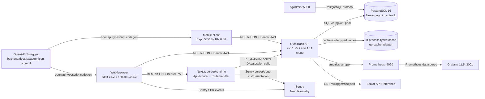
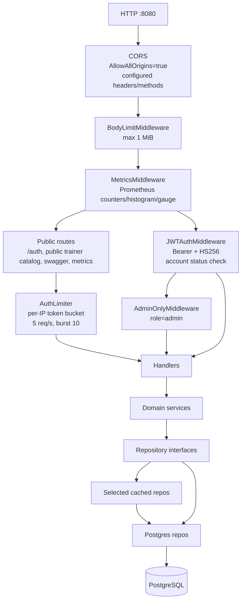
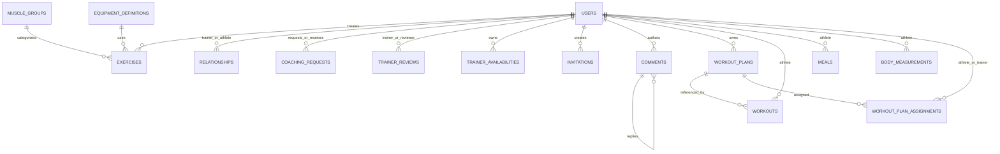
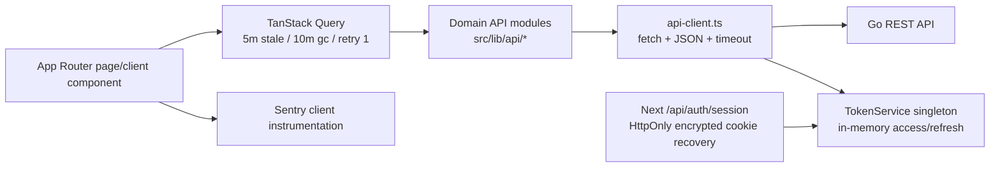

# GymTrack Technical Architecture

Evidence-based map of repository at 2026-08-07. Paths are repository-relative. Unknown behavior is listed under **Assumptions / Gaps**.

## 1. System overview

GymTrack monorepo contains:

- `backend/`: Go HTTP API, PostgreSQL persistence, typed in-process cache, Prometheus metrics.
- `frontend/`: Next.js web app with App Router and `next-intl` locale routing.
- `mobile/`: Expo Router React Native app, also exportable to web.
- `postgres/`, `docker-compose.yml`: local PostgreSQL and observability environment.



### Stack versions detected from manifests

| Component | Evidence                                    | Versions                                                                                                                                                                                                                                                |
| --------- | ------------------------------------------- | ------------------------------------------------------------------------------------------------------------------------------------------------------------------------------------------------------------------------------------------------------- |
| Backend   | `backend/go.mod`                            | Go `1.25.0`; Gin `1.11.0`; pgx `5.10.0`; Fx `1.24.0`; JWT `v5.3.1`; x/crypto `0.51.0`; validator `v10.30.1`; Prometheus client `1.20.5`; zap `1.27.1`; CORS `1.7.6`; swag `v2.0.0-rc5`; Testcontainers Postgres `0.43.0`.                               |
| Web       | `frontend/package.json`                     | Next `16.2.4`; React/DOM `19.2.3`; TypeScript `5.9.3`; next-intl `4.11.0`; TanStack Query `5.99.2`; Zustand `5.0.12`; TanStack Form `1.29.1`; Zod `4.3.6`; Tailwind `4.2.4`; Playwright `1.59.1`; Vitest `4.1.5`; Sentry Next `10.65.0`; pnpm `9.12.3`. |
| Mobile    | `mobile/package.json`                       | Expo `~57.0.8`; Expo Router `~57.0.8`; React Native `0.86.0`; React `19.2.3`; React Navigation `7.0.0`; TanStack Query `5.99.0`; Zustand `5.0.0`; Zod `4.3.0`; TypeScript `~6.0.3`; `@expo/ui 57.0.7`; pnpm `9.12.3`.                                   |
| Infra     | `docker-compose.yml`, `postgres/Dockerfile` | PostgreSQL custom image `gymtrack-postgres:16-ext`; Prometheus `v2.55.1`; Grafana `11.5.0`; pgAdmin image unpinned.                                                                                                                                     |

## 2. Backend

### Entry point and composition

`backend/cmd/server/main.go` initializes zap and starts Uber Fx module `app.RepositoryModule`. Separate schema tooling entry point is `backend/cmd/ensure-schema/main.go`. `backend/internal/app/module.go` is composition root:

1. Loads config from `.env`, `../.env`, `../../.env` (`internal/config/config.go`).
2. Requires `JWT_SECRET`, minimum 32 chars.
3. Creates pgx pool (`internal/config/postgres.go`): max 25, min 2, lifetime 30m, idle 5m, startup ping with 10s timeout.
4. Creates repository factory, typed cache adapters, cached repository decorators.
5. Creates domain services, handlers, Gin engine, Prometheus registry.
6. Registers routes.
7. Starts `http.Server` on `:8080`: read 10s, header 5s, write 30s, idle 120s.
8. Performs graceful Fx shutdown with 10s context.

### Middleware and routing



Global order in `backend/internal/app/module.go:213-217`: CORS, body limit, metrics. Auth is route/group middleware. Auth routes (`backend/internal/api/routes/auth_routes.go`) use per-IP limiter. Protected routes use `JWTAuthMiddleware`; admin routes add `AdminOnlyMiddleware` (`admin_routes.go`). `rate_limit_middleware.go` explicitly documents in-memory single-instance operation and Redis replacement for multi-instance deployment.

Route registration is in `backend/internal/app/module.go:222-240`; route modules in `backend/internal/api/routes/` cover:

- `/api/auth`: register, login, refresh, logout.
- Users/admin.
- Workouts and trainer client workouts.
- Meals and trainer client meals.
- Body measurements and client measurements.
- Relationships, comments, exercises.
- Trainer catalog, availability, reviews.
- Coaching requests.
- Workout plans and assignments.
- `/metrics`, `/swagger/doc.json`, `/swagger/index.html`, `/swagger`.

### Layers and service boundaries

- **Handlers:** `backend/internal/api/handlers/`; JSON decode/encode, HTTP status/error mapping.
- **Services:** `backend/internal/domain/services/`; `AuthService`, `UserService`, `WorkoutService`, `MealService`, `CommentService`, `ExerciseService`, `TrainerCatalogService`, `AvailabilityService`, `ReviewService`, `CoachingRequestService`, `WorkoutPlanService`, `BodyMeasurementService`, `InvitationService`, `AdminService`.
- **Repository ports:** `backend/internal/domain/repositories/`; services receive interfaces.
- **Persistence:** `backend/internal/infrastructure/persistence/postgres/`; concrete pgx SQL repositories.
- **Composition:** `backend/internal/infrastructure/persistence/repository.go`; factory creates all concrete repositories from one pool.
- **Clock abstraction:** `backend/internal/utils/clock.go`; services can use real/test clock.

Example: `WorkoutService` (`backend/internal/domain/services/workout_service.go:17-57`) validates request and model, enforces athlete-only creation, then calls `WorkoutRepository`. This shows business rules stay above persistence.

### Auth

`backend/internal/domain/services/auth_service.go` implements local auth:

- bcrypt password hashes.
- HS256 JWT claims: `userId`, `role`, `exp`, `type`.
- Access token lifetime 1h; refresh token lifetime 7d.
- `JWTAuthMiddleware` requires `Authorization: Bearer <token>`, validates signature/type/expiry, sets `userID` and `userRole`, then loads user and blocks non-active status.
- `AdminOnlyMiddleware` requires `models.RoleAdmin`.

No external identity provider is present in source.

### Data layer

Schema source: `backend/migrations/001_initial_schema.up.sql`; down migration exists. Later migrations:

- `002_add_user_status.up.sql`: `users.status` active/suspended/banned.
- `003_add_exercise_verified.up.sql`: `exercises.is_verified`.
- `004_drop_exercise_legacy_id.up.sql`: drops legacy Couchbase column and adds unique `exercises.name`.



Key tables, constraints, indexes:

- `users`: unique username/email; role check `trainer|athlete|admin`; `profile JSONB`; status migration.
- `muscle_groups`, `equipment_definitions`: unique codes.
- `exercises`: optional muscle/equipment FKs; creator `ON DELETE SET NULL`; category/muscle/equipment/name indexes; verification migration; unique name migration.
- `relationships`: trainer/athlete cascade FKs; status pending/active/terminated; unique `(trainer_id, athlete_id)`; trainer/athlete status indexes.
- `coaching_requests`: athlete/trainer cascade FKs; pending/accepted/rejected; actor/status indexes.
- `trainer_reviews`: rating 1-5; unique `(trainer_id, athlete_id)`; trainer index.
- `trainer_availabilities`: day 0-6; `end_time > start_time`; trainer/day index.
- `invitations`: unique code; pending/used/expired; expiry; optional athlete with `SET NULL`.
- `comments`: polymorphic `target_type` (`workout|meal`) + `target_id`; author FK; self-parent FK; content length 1-2000; target/author/parent indexes.
- `workout_plans`: trainer FK, `exercises JSONB`, GIN index.
- `workouts`: athlete/date, optional plan FK, `exercises JSONB`, athlete/date + plan + GIN indexes.
- `meals`: athlete/date, meal type check, `items JSONB`, athlete/date + GIN indexes.
- `body_measurements`: weight/unit checks, body-fat 0-100, `parts JSONB`, notes <=500; GIN index plus expression indexes for chest, waist, hips, biceps, forearms, thighs, calves, neck, shoulder.
- `workout_plan_assignments`: plan/athlete/trainer FKs; active status; unique `(plan_id, athlete_id)`.

Schema uses normalized relational ownership/relationships plus JSONB for flexible profile, exercise-set, meal-item, plan-exercise, and body-part payloads.

### Backend integrations

- PostgreSQL: SQL over pgx/v5. `backend/internal/infrastructure/persistence/postgres/doc.go` says PostgreSQL is sole persistence backend after Couchbase migration.
- Prometheus: scrape `GET /metrics`; registry exposes Go/process/build collectors and HTTP metrics.
- Grafana: Prometheus datasource in Compose.
- Scalar: Swagger route serves UI; inline HTML loads `https://cdn.jsdelivr.net/npm/@scalar/api-reference`.
- No evidence of payments, object storage, push provider, OAuth, gRPC, inbound webhooks, or third-party business API.

## 3. Web frontend

### Routing/runtime

`frontend/src/app/[locale]/layout.tsx` wraps locale pages. `frontend/src/i18n/routing.ts` defines locales `en`, `tr`, default `en`, `localePrefix: 'as-needed'`. App Router groups `(auth)` and `(dashboard)` split login/register from dashboards. Dashboard routes cover athlete, trainer, admin, profile, workouts, meals, measurements, plans, requests, and catalog. `frontend/src/app/api/auth/session/route.ts` is Next session route handler.

`frontend/next.config.ts` composes next-intl, Sentry, and bundle analyzer; enables `cacheComponents`, Webpack memory optimizations, Unsplash remote images, Sentry source-map uploads and `/monitoring` tunnel.

### State and data flow



- TanStack Query provider: `frontend/src/app/[locale]/providers.tsx`.
- Web API client: `frontend/src/lib/api/api-client.ts`; base URL `NEXT_PUBLIC_API_URL` or `http://localhost:8080/api`; adds JSON and Bearer headers; supports params/timeouts.
- Domain modules: `frontend/src/lib/api/` includes auth, user, workout, meal, comment, relationship, trainer client/catalog, availability, review, coaching request, exercise, body measurement, workout plan, admin.
- Client auth: `frontend/src/lib/token-service.ts` keeps tokens in memory. Its comments state refresh recovery uses encrypted HttpOnly session cookie through `/api/auth/session`.
- Forms/validation: TanStack React Form + Zod schemas in `frontend/src/lib/validations/`.
- Zustand is dependency/client-state mechanism; TanStack Query remains server-state/cache mechanism.
- Sentry files: `frontend/src/instrumentation-client.ts`, `sentry.server.config.ts`, `sentry.edge.config.ts`.

### Build/test

Scripts in `frontend/package.json`: dev/build/start, lint, Vitest, Playwright, i18n validation, OpenAPI codegen. `frontend/playwright.config.ts` tests Chromium, Firefox, WebKit, Mobile Chrome; launches `node mock-backend/server.js` and Next dev server. `frontend/.env.example` defines `SESSION_SECRET`, API URL, Sentry DSNs and source-map variables.

## 4. Mobile

`mobile/package.json` entry is `expo-router/entry`. `mobile/app/_layout.tsx` composes font loading, splash handling, TanStack Query, i18n, Expo UI `Host`, and auth-gated Stack navigation:

- not initialized: `LoadingScreen`;
- unauthenticated: `(auth)` stack;
- authenticated: `(tabs)`, `trainer`, `trainer-catalog`, `athlete` stacks.

Routes under `mobile/app/` cover auth, tabs (dashboard/workouts/meals/profile/measurements), details, trainer catalog, trainer clients/profile/plans/requests, athlete requests/plans/my-trainer.

`mobile/src/api/client.ts` uses `EXPO_PUBLIC_API_URL` or localhost API; JSON fetch, Bearer token, 15s timeout, one 401 refresh through `/auth/refresh`, then session-expired callback. `mobile/src/api/` mirrors backend domains. `mobile/src/stores/authStore.ts` is Zustand auth state. `mobile/src/lib/auth.ts` stores native tokens in Expo Secure Store, web tokens in localStorage. `mobile/src/lib/query-client.ts` uses 5m stale, 10m GC, query retry 1, mutation retry 0.

## 5. Shared contracts/codegen

OpenAPI/Swagger artifacts: `backend/docs/swagger.json`, `backend/docs/swagger.yaml`. Backend serves generated JSON at `/swagger/doc.json`; Scalar consumes it. Backend annotations begin in `backend/cmd/server/main.go`.

```text
backend/docs/swagger.json
        └─ openapi-typescript
           ├─ frontend/src/types/generated.ts  (frontend/package.json:18)
           └─ mobile/src/types/generated.ts    (mobile/package.json:12)
```

No generated Go client/server code found. Swagger generation command/config is not present in inspected package scripts; generated artifacts are checked in.

## 6. Deploy/infra

`docker-compose.yml` provisions local infrastructure:

- `db`: custom PostgreSQL 16 image, port 5432, `pgdata`, first-init `postgres/init-extensions.sql`, pgAudit/pg_partman/pg_stat_statements preload.
- `pgadmin`: port 5050, persistent `pgadmin_data`.
- `prometheus`: port 9090, `./prometheus` config, 7-day retention, persistent data.
- `grafana`: port 3001, provisioning from `./grafana/provisioning`, persistent data.

Backend runs Go directly on 8080. No backend/frontend production Dockerfile, Kubernetes/Terraform, hosting config, or `.github` CI workflow was found. Mobile uses Expo CLI scripts for native, web, and static export.

Environment evidence:

- Backend: `JWT_SECRET`, `POSTGRES_DSN`, `CACHE_ENABLED`; `.env` also has legacy Couchbase variables.
- Web: `SESSION_SECRET`, `NEXT_PUBLIC_API_URL`, Sentry variables.
- Mobile: `EXPO_PUBLIC_API_URL` read by API client; `mobile/.env` exists.

## 7. Layer legend

| Layer               | Responsibility                                  | Locations                                                                            |
| ------------------- | ----------------------------------------------- | ------------------------------------------------------------------------------------ |
| Client presentation | Pages, screens, forms, UI states                | `frontend/src/app`, `frontend/src/components`; `mobile/app`, `mobile/src/components` |
| Client state        | Auth and local UI state                         | Web session/token/Zustand modules; `mobile/src/stores`                               |
| Query/cache         | Server-state fetching and caching               | TanStack Query providers; backend cache decorators                                   |
| API contract        | REST paths, JSON DTOs, JWT header, OpenAPI      | `backend/internal/api`, `backend/docs`, generated TS types                           |
| Middleware          | CORS, body cap, metrics, auth, role, rate limit | `backend/internal/api/middleware`, `internal/app/module.go`                          |
| Handler             | HTTP decode/encode/status mapping               | `backend/internal/api/handlers`                                                      |
| Domain              | Validation, business rules, authorization       | `backend/internal/domain/services`                                                   |
| Repository port     | Persistence interfaces                          | `backend/internal/domain/repositories`                                               |
| Persistence         | pgx SQL and cache decorators                    | `backend/internal/infrastructure/persistence`                                        |
| Database            | Tables, JSONB, constraints, indexes             | `backend/migrations`, PostgreSQL                                                     |
| Observability       | Metrics, dashboards, error telemetry            | `/metrics`, Prometheus, Grafana, Sentry                                              |

## 8. Architectural decisions found in code

1. Uber Fx composition root wires dependencies in `backend/internal/app/module.go`.
2. Repository interfaces isolate services from PostgreSQL adapters.
3. Hybrid normalized relational + JSONB schema supports flexible domain payloads while retaining indexed ownership relations.
4. Selective cache-aside repository decorators cover read-heavy/reference domains; write-heavy domains remain uncached.
5. Local bcrypt + HS256 JWT auth; no external identity provider.
6. One Swagger artifact feeds web/mobile `openapi-typescript` generation.
7. Web and Expo clients share REST backend and parallel domain API modules.
8. Web token memory + HttpOnly session recovery differs from mobile Secure Store persistence.
9. In-memory per-IP auth limiter assumes single instance; source names Redis as multi-instance replacement.
10. Prometheus HTTP middleware and Sentry instrumentation provide separate operational/error telemetry paths.

## 9. Assumptions / Gaps

- No root workspace manifest found; frontend and mobile own package manifests.
- No production container/deployment manifests or CI/CD workflow found; production topology and release steps unknown.
- Couchbase variables remain in `backend/.env`, but current code states migration complete and PostgreSQL sole persistence backend. Runtime Couchbase use not evidenced.
- No `frontend/src/middleware.ts` found; locale behavior is evidenced through next-intl routing/plugin files, but exact edge middleware chain is unknown.
- Migration runner/ordering command not identified; SQL migrations are present.
- Swagger generation command not identified; only artifacts and client codegen scripts are present.
- Sentry project endpoints are environment-dependent; only SDK wiring is visible.
- No payment, storage, push, OAuth, webhook, gRPC, or external business API found in application source.
- CORS uses `AllowAllOrigins=true` and `AllowCredentials=true` in `internal/app/module.go:205-213`; production hardening policy is not in repository.
